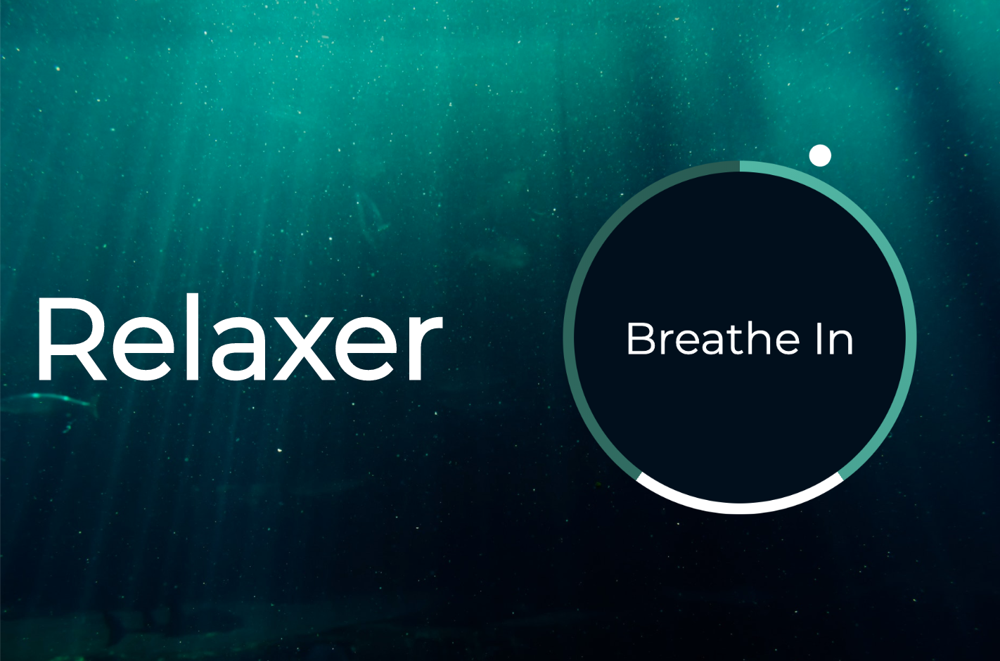
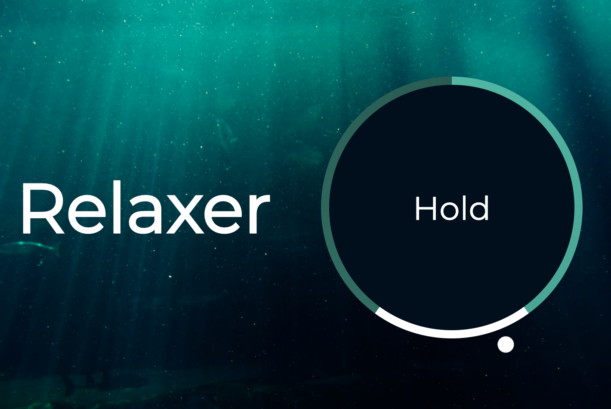
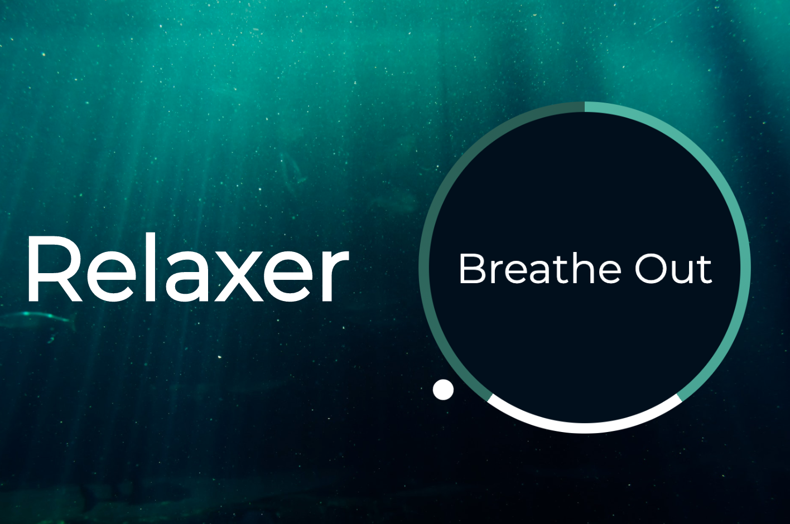

# Inhala y Exhala Breathing App

Take a breath or two and see it in action at [Inhala y Exhala App](https://jssckbl.github.io/relaxer-app/).

The Inhala y Exhala Breathing App visually guides the user through an unlimited number of breath cycles. The circle increases in size for about 5 seconds, holds for 3 seconds, and decreases in size for another 5 seconds. The circle dynamically responds to each of the 3 stages. The white dot moving around the circumference also provides a visual queue for the user.

A full cycle will take just over 13 seconds.

JavaScript, CSS, and HTML are used.

Images below show the three stages. Image is in

Inhale

Hold

Exhale

This project follows along with the [20 Web Projects With Vanilla JavaScript](https://www.udemy.com/course/web-projects-with-vanilla-javascript/) tutorials by [Brad Traversy](https://www.traversymedia.com/).
